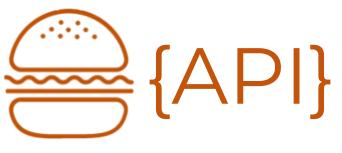
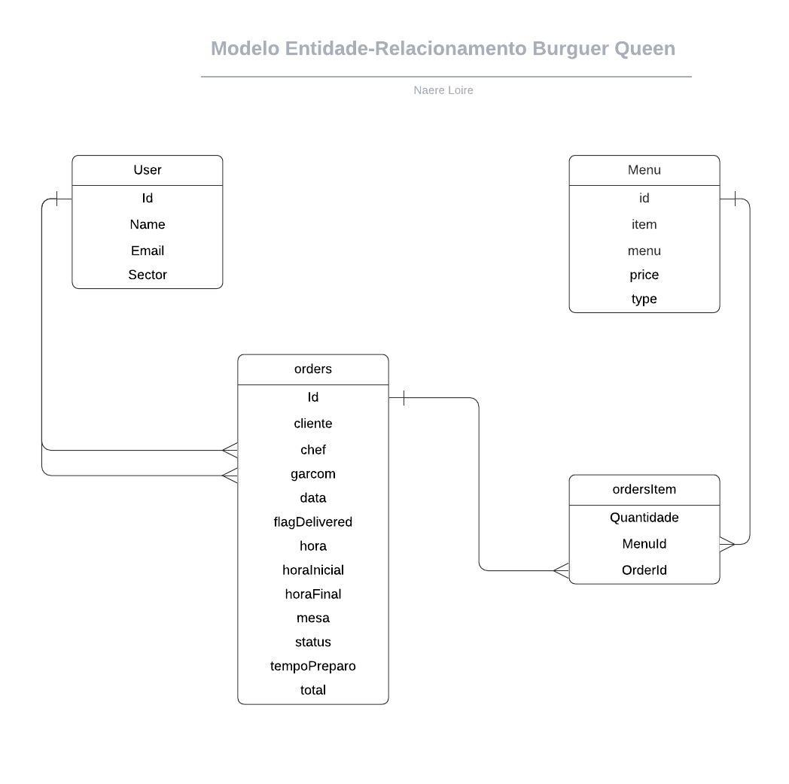

<p align="center">

</p>

<h1 align="center"> API Burger Queen</h1>

<p align="center">


</p>

## Índice

- [1. Resumo do projeto](#1-resumo-do-projeto)
- [1.2 Definições Técnicas](#1.2-definicoes-tecnicas)
- [2. Implementações Futuras](#2-implementacoes-futuras)
- [3. Montagem do ambiente de desenvolvimento](#4-montagem-do-ambiente-de-desenvolvimento)

---

## 1. Resumo do projeto.

A aplicação consiste em servidor web que através de uma [API](https://medium.com/@rullyalves/o-que-s%C3%A3o-apis-e-requisi%C3%A7%C3%B5es-http-919238f48206) **_rest_**, integrada a um banco de dados relacional, fornece métodos de manipulação [CRUD](https://www.codecademy.com/articles/what-is-crud) seguindo o modelo de arquitetura [MVC](https://www.profissionaisti.com.br/o-conceito-e-as-duvidas-sobre-o-mvc/) (Model View Controller).  
[Burger Queen](https://github.com/naereloire/SAP004-burger-queen) foi desenvolvida anteriormente, como uma aplicação de serviço para gerenciamento de pedidos de um restaurante fast-Food, o objetivo da **_API BQ_** é servir como back-end, substituíndo a **_cloud Firestore_** do [Firebase](https://firebase.google.com/?hl=pt-br&gclid=EAIaIQobChMI1sfkkZ7T6wIVk4aRCh399gXrEAAYASAAEgJ9p_D_BwE), possibilitando utilização de rotas para criação de usuários, menus e pedidos.

### 1.2 Definições Técnicas

- **Docker:**

A aplicação está encapsulada em um [Docker](https://www.docker.com/), com imagem do Node. Js integrada ao banco de dados [PostgreSQL](https://cloud.google.com/sql/docs/postgres)

- **Modelagem:**

Para orientar a modelagem do banco de dados, pensando nas necessidade da aplicação **_Burger Queen_**, foi realizado um [**_DER_**](https://medium.com/@mauriciogeneroso/banco-de-dados-diagrama-entidade-x-relacionamento-der-5ce497d930db) (Diagrama Entidade Relacionamento) demonstrado abaixo:

<p align="center">

</p>

- **Documentação:**

A Documentação da API foi realizada utilizando [Swagger](https://swagger.io/), que facilita o entendimento das rotas e possibilita a execução das requisições, como base nos modelos de payload.

## 2. Implementações Futuras.

- Desenvolvimento de testes de integração.
- Unificação de rotas **_Orders_** e **_ordersItens_**.
- Criação de rotas de **_Histórico_** e **_Autenticação_**.

## 3. Montagem do ambiente de desenvolvimento.

<p align="center">
 
</p>

> :warning: Será necessária a utilização:  
> [Node.js](https://nodejs.org/) que contém o [npm](https://docs.npmjs.com/) para instalação das dependências.

> :warning: Neste projeto a regras de [ESLint](https://eslint.org/) estão de acordo com o [Airbnb JavaScript Style Guide](https://github.com/armoucar/javascript-style-guide).

> :warning: O **_deploy_** foi realizado com [Heroku](https://www.heroku.com/).

- [Clone](https://help.github.com/articles/cloning-a-repository/) o projeto na sua máquina executando o seguinte comando no seu terminal:

```sh
git clone https://github.com/naereloire/SAP004-burger-queen-api.git
```

- Instale as dependências do projeto com o comando:

```sh
npm install
```

- Suba a imagem do docker e BD executando:

```sh
docker-compose up
```

**_Nesse momento serão realizadas as migrations que criarão as tabelas no BD_**

- Deploy:

```sh

```

<p align="center">
Esse projeto faz parte do currículo do <a href="https://www.laboratoria.la/br">Bootcamp da Laboratória Brasil</a>
</p>

<p align="center">
Desenvolvido por: 
<p/>

<p align="center">
:rocket:
 <a href="https://github.com/naereloire">Naere Loire</a> :rocket:
<p/>
